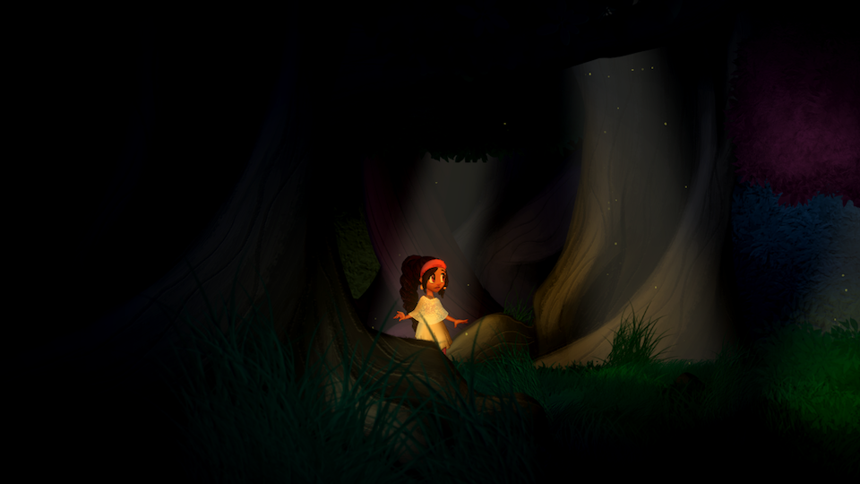

# Spoopy Woods

...or Spine June, or Spine Unity Demo, or whatever. This is a quick project, put together over a couple of weeks worth of spare time. It is meant to be a technical demo of Spine animation and 2D lighting in Unity. For those digging into it, it is also a horrible mess.

All game assets are free to use. If you make something cool, we'd love to check it out!

Download the [Mac build](https://github.com/CyanLetter/SpineJune/releases/download/v1.0/SpoopyWoods_03.app.zip)

## Credit

Animation and art by [Dianna Bedell](http://radjulon.tumblr.com/)

Code and level design by [Dakota Ling](https://github.com/CyanLetter)

Royalty Free Music from [Bensound](http://www.bensound.com/royalty-free-music/track/ofelias-dream)

Sound effects by [everythingsounds](http://freesound.org/people/everythingsounds/sounds/199515/)
and [InspectorJ](http://freesound.org/people/InspectorJ/sounds/352514/)

## License

This project is licensed under a [Creative Commons Attribution (CC BY 4.0)](https://creativecommons.org/licenses/by/4.0/) license, except for audio, which is subject to the licenses of the respective authors.
